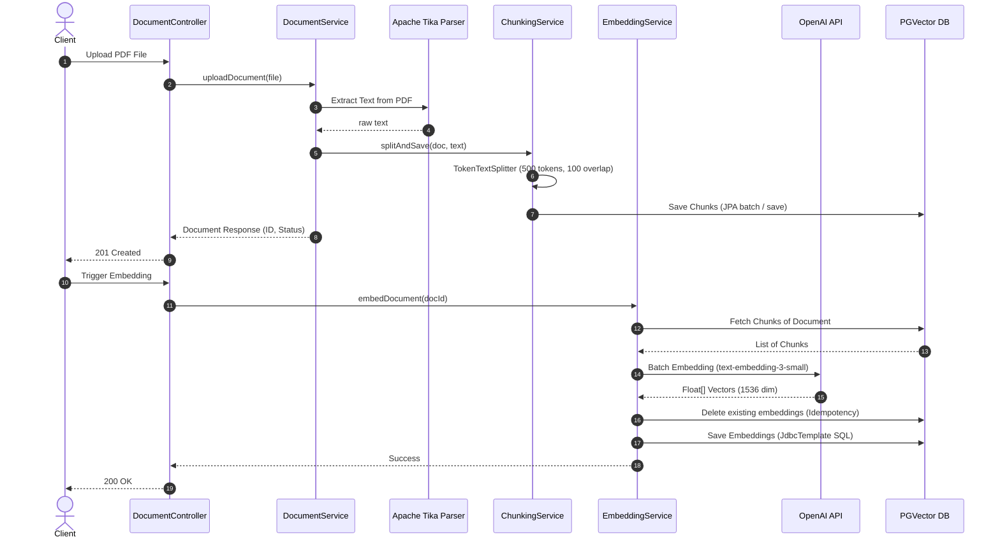

# 📂 Document Intelligence Platform

> **"문서를 저장하는 시스템이 아니라, 문서를 이해하는 시스템"**
> 
> AI 프레임워크의 고수준 추상화 계층에만 의존하지 않고, 데이터베이스 정규화 모델링과 pgvector SQL 쿼리를 직접 통제하여 파이프라인의 안전성과 검색 정확도를 계측·개선한 PDF 분석용 RAG(Retrieval-Augmented Generation) Q&A 백엔드 플랫폼입니다.

---

## 📌 Project Overview & Goals

본 프로젝트는 RAG 기반 문서 질의응답 시스템을 직접 설계·구현하며 AI 백엔드 개발에 필요한 데이터 파이프라인, 벡터 검색, RAG 구성 요소를 학습하고 검증하기 위해 개발되었습니다. 

* **직접 제어하는 벡터 영속성 계층**: Spring AI의 기본 `PgVectorStore`를 사용한 블랙박스형 데이터 적재 대신, RDB 정규화 규칙을 따르는 테이블 설계와 `JdbcTemplate` 기반의 네이티브 pgvector SQL 구현을 통해 데이터 통제력을 확보했습니다.
* **검증 지향적 아키텍처**: 9개의 실제 전문 문서 PDF(학칙, 가명정보 가이드라인 등)를 대상으로 **1,084개의 실데이터 청크**를 적재한 뒤, 20개의 검증용 골드셋(Gold Set) 평가 질문을 통해 Retrieval 적중률 및 RAG QA 성능 데이터를 물리적으로 계측했습니다.
* **비용 및 지연 시간 최적화**: API 네트워크 호출 비용과 외부 LLM 지연을 방어하기 위해 Fast-path Bypass 구조 및 OpenAI API Batch 호출 구조를 설계·적용했습니다.

---

## 🛠️ Technology Stack

### Backend
* **Language**: Java 21
* **Framework**: Spring Boot 3.5.14
* **AI Integration**: Spring AI 1.0.0-M6
* **Database Access**: Spring Data JPA (Hibernate 6.x), Spring JDBC (`JdbcTemplate`)

### Database & Infrastructure
* **Vector Database**: PostgreSQL 16 (pgvector)
* **Container**: Docker Compose

### Parsing & Extraction
* **Document Parser**: Apache Tika 3.0.0, Apache PDFBox 3.0.3

### AI Models (OpenAI API)
* **Embedding Model**: `text-embedding-3-small` (1536 Dimensions)
* **LLM Chat Model**: `gpt-4o`

---

## 📐 System Architecture

본 플랫폼은 **계층 간 관심사 분리(Decoupling)** 및 **개방-폐쇄 원칙(OCP)**을 극대화하여 설계되었습니다. 유사도 검색 모듈(`RetrievalService`)은 대화 모듈(`RagService`)에 의존하지 않고 독립적으로 동작하며, 향후 AI Agent의 독립 도구(Tool)로 즉시 재사용할 수 있습니다.

```mermaid
graph TD
    Client[Client / Rest Client] -->|POST /api/v1/rag/ask (question)| Controller[RagController]
    Controller -->|RagRequest| Service[RagService]
    Service -->|search question, limit=5| Retrieval[RetrievalService]
    Retrieval -->|query text| OpenAI_Embed[OpenAI EmbeddingModel]
    OpenAI_Embed -->|float[] queryVector| Retrieval
    Retrieval -->|queryVector, limit| Store[EmbeddingStore]
    Store -->|JdbcTemplate SQL Cosine Distance ASC| DB[(PGVector DB)]
    DB -->|Result Rows| Store
    Store -->|List of Chunks| Retrieval
    Retrieval -->|List of Chunks| Service
    
    Service -->|Check if Empty| Decision{Are Chunks Empty?}
    Decision -->|Yes: 조기 우회 반환| BypassResponse[Return: 제공된 문서 내에...]
    Decision -->|No: RAG Prompt 빌딩| PromptBuild[Build Combined Prompt with Context]
    
    PromptBuild -->|Prompt| ChatModel[OpenAI ChatModel]
    ChatModel -->|ChatResponse| Service
    Service -->|RagResponse (question, answer)| Controller
    Controller -->|JSON Response| Client
    
    BypassResponse -->|RagResponse (question, answer)| Controller
```

---

## 🔄 Data Ingestion Pipeline

문서(PDF) 업로드부터 텍스트 추출, 청킹 분할, 벡터 임베딩 생성 및 영속화까지의 전체 데이터 적재 흐름입니다.



### 1. Document Upload & Text Extraction
* 파일 저장 및 분석의 관심사 분리를 위해 업로드된 PDF는 로컬 스토리지에 격리 저장됩니다.
* **Apache Tika** 파서를 이용해 PDF 내부 메타데이터와 텍스트를 추출하며, 성공 시 Document 엔티티 상태는 `UPLOADED`에서 `PARSED`로 변경됩니다.

### 2. Token-based Chunking
* 추출된 단일 대형 텍스트는 **Spring AI `TokenTextSplitter`**를 사용하여 청킹 분할을 수행합니다.
* 한글 문맥 유실 방지 및 토큰 효율성을 고려하여 **Chunk Size: 500 Tokens, Overlap: 100 Characters**로 조율되었습니다. 분할된 조각들은 `chunks` 테이블에 순차 기록됩니다.

### 3. Batch Embedding Generation & Idempotency Storage
* 임베딩 요청 시 해당 문서의 청크 리스트를 DB에서 읽어 **OpenAI Batch API(`embedForResponse(List<String>)`)**를 단 1회 호출하여 대기 시간(Latency) 및 API RPM 한도를 최적화합니다.
* 데이터 적재 시 멱등성을 확보하기 위해, 기존에 존재하는 해당 문서의 임베딩 레코드를 먼저 제거(`deleteByDocumentId`)한 후 신규 벡터 데이터를 벌크 삽입합니다.

---

## 💾 Database Schema Design

RDB의 무결성 보장과 유연한 CASCADE 처리를 위해 `documents`, `chunks`, `embeddings`의 3단계 테이블 구조로 정규화하여 관리합니다.

```
┌───────────────┐        ┌───────────────┐        ┌────────────────┐
│   documents   │──(1:N)─>│    chunks     │──(1:1)─>│   embeddings   │
└───────────────┘        └───────────────┘        └────────────────┘
```

### 1. `documents` (문서 마스터 테이블)
업로드된 개별 PDF 문서의 식별자와 상태 메타데이터를 저장합니다.
| 컬럼명 | 데이터 타입 | 제약 조건 | 설명 |
| :--- | :--- | :--- | :--- |
| `id` | UUID | PRIMARY KEY | 문서 식별자 |
| `file_name` | VARCHAR(255) | NOT NULL | 원본 파일명 |
| `file_path` | VARCHAR(500) | NOT NULL | 서버 내 저장 경로 |
| `file_type` | VARCHAR(255) | NOT NULL | 파일 마임 타입 (PDF 등) |
| `file_size` | BIGINT | NOT NULL | 파일 크기 (Bytes) |
| `upload_date` | TIMESTAMP | NOT NULL | 업로드 일시 |
| `extracted_text`| TEXT | NULLABLE | Apache Tika가 추출한 원본 텍스트 |
| `processing_status`| VARCHAR(50) | NOT NULL | 분석 상태 (`UPLOADED`, `PARSED`, `FAILED`) |

### 2. `chunks` (의미 단락 분할 테이블)
문서에서 쪼개진 텍스트 조각들을 순서대로 저장합니다.
| 컬럼명 | 데이터 타입 | 제약 조건 | 설명 |
| :--- | :--- | :--- | :--- |
| `id` | UUID | PRIMARY KEY | 청크 식별자 |
| `document_id` | UUID | FOREIGN KEY REFERENCES `documents(id)` | 부모 문서 매핑 (`ON DELETE CASCADE`) |
| `chunk_index` | INTEGER | NOT NULL | 문서 내 배치 순서 (0-indexed) |
| `content` | TEXT | NOT NULL | 분할된 원본 한글 텍스트 내용 |
| `created_at` | TIMESTAMP | NOT NULL | 생성 일시 |

### 3. `embeddings` (벡터 벡터스토어 테이블)
청크에 매핑된 고차원 벡터 데이터와 생성 모델 정보를 담고 있습니다.
| 컬럼명 | 데이터 타입 | 제약 조건 | 설명 |
| :--- | :--- | :--- | :--- |
| `id` | UUID | PRIMARY KEY | 임베딩 레코드 식별자 |
| `chunk_id` | UUID | UNIQUE, FOREIGN KEY REFERENCES `chunks(id)` | 청크 매핑 (`ON DELETE CASCADE`) |
| `embedding` | VECTOR(1536) | NOT NULL | OpenAI `text-embedding-3-small` 벡터값 |
| `model_name` | VARCHAR(100) | NOT NULL | 임베딩 생성에 사용된 모델명 |
| `created_at` | TIMESTAMP | NOT NULL | 적재 일시 |

* **인덱스 설계**: `chunk_id`와 `model_name` 복합 조건 검색 속도를 높이기 위해 `idx_embeddings_chunk_model` 인덱스를 지정했습니다.

---

## 🔍 Retrieval & RAG QA Core Mechanism

### 1. Retrieval 구조 및 쿼리 최적화
유사도 검색 시 코사인 거리 연산 방식을 튜닝하여 DB 엔진의 불필요한 사칙연산 오버헤드를 방어했습니다.

* **코사인 유사도 거리 연산자 (`<=>`)**:
  * PostgreSQL pgvector 플러그인은 코사인 거리를 나타내는 `<=>` 연산자를 네이티브로 제공합니다.
  * DB 옵티마이저가 정렬 인덱스를 효율적으로 타고 탐색을 가속화하도록, `ORDER BY` 절에서는 정형화된 수학적 변환식을 거치지 않은 순수 거리값 기준 오름차순 정렬 `ORDER BY e.embedding <=> ?::vector ASC`을 명시합니다.
  * 계산된 코사인 유사도 스코어(`1 - distance`)는 최종 반환을 위한 프로젝션(`SELECT` 절) 단계에서만 딱 1회 연산하여 불필요한 행 단위 스코어 계산 비용을 아꼈습니다.
* **JdbcTemplate 기반 네이티브 SQL**:
  ```sql
  SELECT 
      c.id AS chunk_id, 
      c.document_id AS document_id, 
      c.content AS content, 
      (1 - (e.embedding <=> ?::vector)) AS similarity 
  FROM embeddings e 
  INNER JOIN chunks c ON e.chunk_id = c.id 
  ORDER BY e.embedding <=> ?::vector ASC 
  LIMIT ?
  ```

### 2. RAG 구조 및 Fast-path Bypass
RAG 동작 시 토큰 낭비 및 의미론적 할루시네이션(환각) 현상을 제어하기 위해 두 가지 방어 메커니즘을 적용했습니다.

* **Fast-path Bypass (조기 우회 반환)**:
  * 사용자 질문을 임베딩하여 벡터 데이터베이스 내 유사도 검색을 수행한 결과, 반환된 청크 데이터가 전무한 경우(`chunks.isEmpty()`) 외부 LLM ChatModel API 호출을 거치지 않고 즉각 우회 답변(`"제공된 문서 내에 해당 질문에 답변할 수 있는 관련 정보가 존재하지 않습니다."`)을 반환합니다.
  * 이를 통해 무의미한 네트워크 왕복 오버헤드를 차단(0ms 지연)하고 OpenAI 사용료를 물리적으로 절감합니다.
* **Combined Prompt 템플릿 제약**:
  * RAG 프롬프트 내부 지시사항을 통해 모델이 검색된 컨텍스트를 우선 활용하도록 유도하고, 문서에 없는 정보에 대해서는 우회 응답을 반환하도록 설계했습니다.

---

## 🧪 Validation & Performance Results

### 1. 실측 검증 및 평가 방법론
실제 프로젝트 환경에 도메인별 전문 PDF 문서들을 적재하고 20대의 질문 시나리오로 이루어진 골드셋(Gold Set)을 순회 호출해 검증을 수행했습니다.

* **테스트 데이터 구성**:
  * **적재 PDF 수**: 9개 (대학원 학칙, 개인정보 가명처리 가이드라인, 공공부문 AI 도입 현황, 사이버 위협 동향 등)
  * **생성된 Chunk 수**: 1,084개
  * **평가용 질문셋**: 20개 (문서 내에 답이 존재하는 개별 질문 및 관련 정보가 없는 결측 질문 포함)
* **평가 방식 및 기준**:
  1. **Retrieval 수동 검증**: 20개 검증 질문에 대해 관련 문서 청크가 Top-K(K=5) 검색 결과 내에 적절히 포함되는지를 수동으로 확인 및 평가했습니다.
  2. **RAG 답변 정합성(Groundedness) 수동 검증**: 생성된 최종 답변에 대해 수동 평가를 수행했습니다. 문서에 없는 질문에 대해서는 할루시네이션(환각 답변) 없이 우회 응답을 정확히 반환하는지 검증하고, 문서에 존재하는 질문에 대해서는 검색된 컨텍스트 기반의 정합성 높은 답변이 정상적으로 유도되는지 확인했습니다.

### 2. 주요 검증 데이터 예시
| 번호 | 테스트 질문 (Question) | 유사도 (Score) | RAG QA 최종 LLM 답변 (Answer) | 결과 판정 |
| :---: | :--- | :---: | :--- | :---: |
| **1** | 경남대 대학원 학칙 상 수료를 위해 필요한 최저 취득 학점 규정은? | 0.886 | 일반대학원 및 특수대학원 석사는 24학점 이상, 박사는 36학점 이상이며 북한대학원 석사는 27학점 이상 필요합니다. | **성공 (정답 도출)** |
| **4** | 가명처리 시 추가 정보의 격리 보관 및 안전성 확보 조치 의무는? | 0.886 | 추가 정보는 가명정보와 분리하여 별도로 저장 및 관리해야 하며 접근 권한 최소화 등 안전성 확보 조치가 필요합니다. | **성공 (정답 도출)** |
| **19**| RDBMS에 벡터 데이터를 적재할 때 데이터 무결성을 보장하기 위해 적용한 DDL 제약조건은? | 0.835 | 제공된 문서 내에 해당 질문에 답변할 수 있는 관련 정보가 존재하지 않습니다. (문서 외 범위의 시스템 내부 구현 질문 차단) | **성공 (우회 작동)** |
| **20**| 경남대 대학원 학칙 중 장기 해외 연수 시 등록금 전액 면제 혜택 조건은? | 0.877 | 제공된 문서 내에 해당 질문에 답변할 수 있는 관련 정보가 존재하지 않습니다. (학칙 본문 외의 누락된 조항에 대한 환각 차단) | **성공 (우회 작동)** |

### 3. 성능 측정 결과 (지연 시간 분석)

20회 자동화 계측용 스크립트 실행 결과를 바탕으로 산출한 구간별 평균 레이턴시 분포도입니다.

```
RAG Total Response Time
1307ms

├── Retrieval
│   └── 244ms (18.7%)

└── OpenAI Generation
    └── 1063ms (81.3%)
```
> ※ 로컬 개발 환경 기준 측정값 (PostgreSQL 16 + Docker Compose + 개인 개발 PC)

* **지연 요인 분석**: 전체 RAG 처리 시간(평균 1,307ms) 중 외부 OpenAI ChatModel의 문장 생성에 소요되는 지연 시간이 **1,063ms(81.3%)**로 절대적인 병목을 형성하고 있습니다.
* **백엔드 통제 가능 구간 성능**: 데이터베이스 코사인 유사도 쿼리와 OpenAI 임베딩 생성 모델 호출을 포괄하는 Retrieval 구간은 평균 244ms(18.7%) 수준으로 기동합니다. 현재 데이터 규모(1,084개 청크)에서는 Retrieval 단계가 Generation 단계 대비 상대적으로 짧은 지연 시간을 보였습니다.

---

## 🛠️ Troubleshooting Deep Dive

### 1. TokenTextSplitter 설정 조율을 통한 한글 의미 유실 방어
* **문제 상황**: Spring AI `TokenTextSplitter` 사용 시 기본 설정을 그대로 기동했을 때 기대보다 과도하게 문맥이 분리되어 문장 중간이 끊기거나 검색 품질이 저하되는 현상이 발생했습니다.
* **원인 분석**: 디폴트 토크나이저의 기본 청킹 파라미터는 한글 문장 경계를 세밀하게 인식하지 못하고 형태소나 구절을 인위적으로 갈라놓아, 벡터 공간 상의 코사인 유사도 매칭 성능을 떨어뜨렸습니다.
* **해결 방법**: `TokenTextSplitter` 생성자의 `keepSeparator` 옵션을 `true`로 명시해 문장 구별 경계를 보존하였고, 청킹 파라미터를 **Chunk Size: 500 Tokens, Overlap: 100 Characters**로 조정하여 검색 품질과 컨텍스트의 연속성을 개선했습니다.

### 2. PostgreSQL @Lob OID 매핑 오류로 인한 텍스트 깨짐 및 RAG 실패 장애 해결
* **문제 상황**: 데이터 적재 후 Retrieval 탐색을 통해 획득한 청크 원본 데이터가 한글 텍스트 대신 `16912` 등 의미 불명의 정수(포인터 값)로 출력되어 RAG QA가 정상적으로 응답을 만들지 못했습니다.
* **원인 분석**: JPA Hibernate 엔티티 설계 시 `content` 필드에 `@Lob` 어노테이션을 부착함에 따라 PostgreSQL 16 드라이버가 이를 단순 `TEXT` 데이터 타입이 아닌 **Large Object (OID)** 타입으로 정의했습니다. 그 결과 DB 컬럼에는 실제 텍스트가 아닌 OID 고유 참조 인덱스 번호가 바인딩되었고, JPA와 네이티브 JDBC 간 데이터 바인딩 시점에서 한글 디코딩 및 참조 매핑 불일치가 일어나 텍스트 원본 조회가 무산되었습니다.
* **해결 방법**: 엔티티 클래스 정의에서 `@Lob`을 완전히 소거하고 `@Column(columnDefinition = "TEXT", nullable = false)` DDL 정의를 선언하여 실제 텍스트 문자열이 가공 없이 영속되도록 제어했습니다. 이후 스키마 리빌드를 거쳐 정상 데이터를 획득했습니다.

### 3. Spring AI AssistantMessage 호환성 문제 해결
* **문제 상황**: Spring AI 1.0.0-M6 환경에서 `SystemMessage`와 `UserMessage`를 병렬로 어레이에 패킹해 ChatModel에 전달하여 호출하는 과정에서, 응답 처리 시 `AssistantMessage`와의 매핑 충돌로 인한 호환성 이슈를 경험했습니다.
* **원인 분석**: 사용 중인 마일스톤 버전 스펙상 멀티 메시지(SystemMessage + UserMessage) 구조로 프롬프트를 빌드하여 보낼 때 역직렬화 및 응답 구조 매핑 단계에서 일부 불일치가 발생한 문제였습니다.
* **해결 방법**: 시스템의 행동 지시서(Instruction), DB에서 검색한 참고 문맥(Context), 사용자 질문(Question)을 하나의 템플릿 문자열(`COMBINED_TEMPLATE`)에 정밀 바인딩한 뒤, 단일 `Prompt` 객체 인자로 주입 호출하도록 프롬프트를 리팩토링하여 프레임워크 수준의 바인딩 충돌을 방지하고 호환성 문제를 해결했습니다.

---

## 💡 Lessons Learned (배운 점)

* **프레임워크 추상화 너머의 제어 필요성**: Spring AI가 라이브러리 내부에 래핑한 API에만 의존했다면 영속성 테이블 정규화 설계나 pgvector `<=>` 오름차순 쿼리 튜닝, 대용량 업로드 멱등성 보장 등을 주도적으로 튜닝하지 못했을 것입니다. 시스템 구성 요소를 개발자가 직접 분해해 제어할 때 깊은 수준의 제어력이 생긴다는 점을 실감했습니다.
* **실측 및 지표 지향적 엔지니어링**: RAG 시스템을 구현할 때 주관적인 어조의 "잘 된다"는 평가는 설득력이 떨어집니다. 20대의 대표 시나리오를 구성해 Retrieval Hit Rate 및 Groundedness를 측정하고 1.3초 응답 속도 중 81%가 외부 모델 병목임을 데이터로 밝혀냄으로써, 객관적으로 현황을 파악하고 최적화의 우선순위를 찾는 경험을 쌓았습니다.

---

## 🚀 Future Roadmap (향후 개선 방향)

1. **비동기 논블로킹(Async) 데이터 파이프라인 전환**:
   * 현재 톰캣 블로킹 서블릿 구조 하에서는 대용량 PDF 문서(수십 MB)가 업로드되어 파싱 및 임베딩을 완료할 때까지 쓰레드가 잡혀 대기하게 됩니다. 이를 위해 `CompletableFuture` 혹은 내부 쓰레드 풀을 활용한 비동기 백그라운드 적재 방식으로 파이프라인을 비동기화할 예정입니다.
2. **대규모 데이터 검색 효율 극대화 (HNSW 인덱싱)**:
   * 문서 적재량이 대규모로 증가해 청크 수가 수만 건 이상에 달하면 순차 탐색 기반 거리 연산 성능이 감퇴합니다. pgvector의 근사 최근접 이웃(ANN) 알고리즘 인덱스 중 재현율(Recall)과 지연 시간(Latency) 트레이드오프가 우수한 HNSW 인덱스를 활성화하여 응답 성능을 방어할 계획입니다.
3. **Observability 모니터링 체계 도입**:
   * 응답 레이턴시 변화 추이, DB 쿼리 실행 속도, OpenAI 호출 에러율 지표를 시각적으로 모니터링하기 위해 Micrometer 메트릭을 수집하고 Grafana/Prometheus 대시보드 환경을 연결하여 시스템 안정성을 관리할 것입니다.
