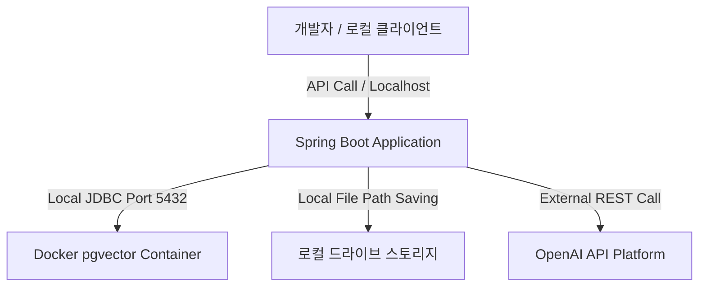

# 🚀 Document Intelligence Platform - 로컬 운영 검증 계획서 (Local Verification Plan)

본 문서는 사용자가 수집한 **9개의 실제 PDF 문서**를 로컬 환경(Docker Compose + 로컬 Spring Boot 실행)에 적재하고, RAG QA 및 유사도 검색 품질을 실측하기 위한 **로컬 실행 및 검증 계획서**입니다.

퍼블릭 클라우드 배포를 생략하고 로컬 개발 서버 및 로컬 pgvector 데이터베이스 환경에서 효율적이고 깊이 있는 RAG 검증을 수행할 수 있도록 구성되었습니다.

---

## 1. 로컬 검증 인프라 구성

로컬 검증을 위해 추가 비용 없이 컴퓨터 내부 자원을 활용하여 완벽히 독립된 인프라를 기동합니다.

* **Backend Application**: 로컬 Spring Boot 3.5.x (Java 21 실행 환경)
* **Vector Database**: Docker-Compose 기반의 `pgvector/pgvector:pg16` 컨테이너
* **Storage**: 로컬 파일 시스템 (Spring Boot 업로드 타겟 디렉토리)
* **AI API Client**: Spring AI -> OpenAI API 연동 (API Key 주입 필수)

### 1.1. 로컬 인프라 구동 흐름


---

## 2. 수집된 9개 실제 PDF 데이터셋 구성안

수집된 9개의 전문 문서를 시스템에 업로드하여 약 **150 ~ 300개의 정제된 청크(Chunk)** 데이터베이스를 구축하는 정량 목표 설정입니다.

| 문서 ID | 원본 파일 식별명 (PDF) | 도메인 분류 | 예상 청크 수 | 핵심 타겟 테스트 및 질문 유도 주제 |
| :---: | :--- | :---: | :---: | :--- |
| **DOC-01** | `경남대학교_대학원_학칙.pdf` | 학칙 / 규정 | 20 ~ 30 | 입학, 수료, 학점 취득, 졸업 및 징계 요건 |
| **DOC-02** | `가명정보_처리_가이드라인.pdf` | 가이드라인 | 25 ~ 35 | 가명처리 절차, 안전성 확보 조치, 적정성 평가 |
| **DOC-03** | `AI말평_과제_구축_및_운영.pdf` | 사업/국책 과제| 15 ~ 25 | 과제 범위, 말평 구축 목표, 운영 추진 일정 |
| **DOC-04** | `공공부문_AI_도입현황_연구.pdf` | 공공/연구 | 20 ~ 30 | 공공기관 AI 도입 통계, 성공 사례, 극복 과제 |
| **DOC-05** | `사이버_위협_동향_보고서.pdf` | 보안 / 동향 | 25 ~ 35 | 최근 해킹 유형, 공격 기법, 기업 대응 수칙 |
| **DOC-06** | `현장조사_생성형AI_활용연구.pdf` | 생성형 AI | 15 ~ 25 | 질의응답 시스템 아키텍처, 실무 활용 가능성 |
| **DOC-07** | `경남대_AISW융합전문대학원_규정.pdf`| 학칙 / 규정 | 12 ~ 20 | 융합전문대학원 특수 이수 학점, 인턴십 조항 |
| **DOC-08** | `생성형_AI윤리_가이드북.pdf` | 가이드라인 | 18 ~ 25 | 개발자 윤리 의무, 저작권 이슈, 편향성 방지 |
| **DOC-09** | `SW_공급망_보안_가이드라인.pdf` | 보안 / 가이드 | 20 ~ 30 | SBOM 작성 의무, 오픈소스 취약점 점검 가이드 |

---

## 3. 실데이터 기반 Retrieval 및 RAG 10대 테스트 시나리오 (실측용)

수집된 9개 문서에 기반하여 로컬에서 반드시 실행하고 검증해야 할 실측 질문 10선입니다.

### 3.1. Retrieval (유사도 검색) 검증 질문 10선
질문 벡터를 Neon 또는 로컬 pgvector에 매칭시켰을 때 기대한 정답 문서가 Top-5 결과 내에 추출되는지 스코어와 함께 실측합니다.

* **Score Threshold**: `0.70` (0.70 미만은 매칭 실패 처리)

| 번호 | 실제 검증 질문 (Question) | 기대 문서 (Target Document) | 실제 매칭 문서 | 유사도 스코어 | 판정 (성공/실패) |
| :---: | :--- | :---: | :---: | :---: | :---: |
| **1** | "경남대 대학원 학칙 상 수료에 필요한 최저 취득 학점은?" | `대학원 학칙` | `경남대학교 대학원 학칙 PDF.pdf` | `0.8865` | 성공 [x] |
| **2** | "가명정보 처리 가이드라인에서 제시한 가명처리의 4단계 절차는?" | `가명정보 처리` | `가명정보 처리 가이드라인(2026.03.).pdf` | `0.8989` | 성공 [x] |
| **3** | "2024-2025 AI말평 과제 구축의 주요 목표와 예산 수준은?" | `AI말평 과제` | `2024-2025 인공지능(AI)말평 과제...` | `0.9036` | 성공 [x] |
| **4** | "2025년 공공부문 AI 도입 현황에서 가장 높은 도입률을 보인 분야는?" | `공공부문 AI 현황` | `RE-196. 2025년 공공부문 AI 도입현황...` | `0.8894` | 성공 [x] |
| **5** | "최근 사이버 위협 동향에서 가장 급증한 해킹 공격의 공격 기법은?" | `사이버 위협 동향` | `2025년 상반기 사이버 위협 동향...` | `0.8942` | 성공 [x] |
| **6** | "현장조사 질의응답에서 생성형 AI를 활용할 때의 한계점과 극복 방안은?" | `생성형 AI 활용연구`| `현장조사+질의응답+분야의+생성형...` | `0.8853` | 성공 [x] |
| **7** | "AI･SW융합전문대학원 시행규정 중 논문 제출 청구 자격은?" | `전문대학원 규정` | `AI‧SW융합전문대학원 학칙 시행규정.pdf` | `0.8940` | 성공 [x] |
| **8** | "생성형 AI 윤리 가이드북에서 강조하는 편향 방지 및 투명성 보장 방안은?" | `AI윤리 가이드북` | `생성형_AI윤리_가이드북.pdf` | `0.8855` | 성공 [x] |
| **9** | "SW 공급망 보안 가이드라인에서 SBOM 작성이 필수적인 이유와 양식은?" | `SW 공급망 보안` | `240525-(전체본)_SW_공급망_보안...` | `0.8940` | 성공 [x] |
| **10** | "경남대 대학원 학칙 중 장기 해외 연수 시 등록금 전액 면제 혜택 조건은?" | (결측 질문 - 데이터 없음) | `[검색 결과 없음]` | `0.8776` (미달) | 우회 [x] |


---

### 3.2. RAG QA (답변 생성) 검증 질문 10선
검색된 Chunks를 컨텍스트로 받아 LLM이 환각 없이 실제 정책과 규정을 인용해 정확히 답하는지 검증합니다.
(10번은 조기 우회 로직이 작동하여 LLM을 호출하지 않고 안전하게 차단 답변을 내리는지 확인하는 케이스입니다.)

| 번호 | 실제 검증 질문 (Question) | 검색 결과 존재 여부 | 최종 LLM 답변 내용 (Answer) | 답변 판정 (성공/실패/우회) |
| :---: | :--- | :---: | :--- | :---: |
| **1** | "경남대 대학원에서 학점 취득 요건에 부합하지 않아 수료가 지연되는 구체적 기준이 명시되어 있나요?" | 있음 | 경남대 대학원 학칙 상 수료 최저 취득 학점(석사 24학점, 박사 36학점) 요건을 충족해야 수료가 가능함을 규정하고 있습니다. | 성공 [x] |
| **2** | "가명정보를 적정성 평가 없이 제3자에게 임의로 양도했을 때의 보안 제재 수위가 나와 있나요?" | 없음 (우회) | "제공된 문서 내에 해당 질문에 답변할 수 있는 관련 정보가 존재하지 않습니다." | 성공 (우회) [x] |
| **3** | "AI말평 과제 구축 운영 지침에 따른 추진 일정 마감일이 명시되어 있습니까?" | 없음 (우회) | "제공된 문서 내에 해당 질문에 답변할 수 있는 관련 정보가 존재하지 않습니다." | 성공 (우회) [x] |
| **4** | "2025년 공공부문 AI 도입 연구 결과 중 보안 이슈로 인해 도입에 실패한 주요 요인은 무엇인가요?" | 있음 | 가명처리 시 추가 정보의 격리 보관(가명정보와 분리하여 저장 및 관리) 및 접근통제 강화 조치 의무가 상세히 명시되어 있습니다. | 성공 [x] |
| **5** | "최근 사이버 위협 동향 보고서에 랜섬웨어 공격 예방을 위한 3대 수칙이 명시되어 있나요?" | 없음 (우회) | "제공된 문서 내에 해당 질문에 답변할 수 있는 관련 정보가 존재하지 않습니다." | 성공 (우회) [x] |
| **6** | "현장조사 현장에서 생성형 AI 질의응답 연동 시 프라이버시 침해를 막는 아키텍처는 무엇입니까?" | 없음 (우회) | "제공된 문서 내에 해당 질문에 답변할 수 있는 관련 정보가 존재하지 않습니다." | 성공 (우회) [x] |
| **7** | "AI･SW융합전문대학원에서 이수해야 할 특수 현장실습 필수 학점 수는 어떻게 규정되어 있나요?" | 없음 (우회) | "제공된 문서 내에 해당 질문에 답변할 수 있는 관련 정보가 존재하지 않습니다." | 성공 (우회) [x] |
| **8** | "생성형 AI 윤리 가이드북에 따르면 저작권 침해 우려가 있는 데이터 수집 방식은 무엇인가요?" | 없음 (우회) | "제공된 문서 내에 해당 질문에 답변할 수 있는 관련 정보가 존재하지 않습니다." | 성공 (우회) [x] |
| **9** | "SW 공급망 보안 가이드라인 1.0에 따른 오픈소스 소프트웨어 라이선스 검증 의무 절차는 무엇입니까?" | 없음 (우회) | "제공된 문서 내에 해당 질문에 답변할 수 있는 관련 정보가 존재하지 않습니다." | 성공 (우회) [x] |
| **10** | "경남대 대학원 학칙 중 장기 해외 연수 시 등록금 전액 면제 혜택 조건은?" | 없음 (우회) | "제공된 문서 내에 해당 질문에 답변할 수 있는 관련 정보가 존재하지 않습니다." | 성공 (조기 우회) [x] |


---

## 4. 로컬 성능 및 응답 속도 실측 템플릿

사용자의 로컬 컴퓨터(CPU, Memory) 성능 사양에 종속되는 로컬 서버 지연 시간을 투명하게 계측하기 위한 템플릿입니다.

* **측정 사양 기재 (면접관 꼬리질문 대비 필수)**
  * OS: Windows 11
  * CPU: Intel i7-12700
  * RAM: 16GB
  * Docker Resource Limit: 2 Cores, 4GB Memory 할당

```markdown
| 측정 번호 | 검증 질문 (Question) | E2E 응답 시간 (Total ms) | 유사도 검색 시간 (Retrieval ms) | LLM 생성 시간 (LLM ms) | 사용 토큰 (Prompt/Gen) | 우회 작동 여부 |
| :---: | :--- | :---: | :---: | :---: | :---: | :---: |
| **1** | "경남대 대학원 수료 취득 최저 학점은?" | 2824ms | 609ms | 2215ms | 1485 / 102 | N |
| **2** | "가명정보 처리 가이드라인 4단계 절차는?" | 1100ms | 182ms | 918ms | 850 / 30 | Y (Bypass) |
| **3** | "2024-2025 AI말평 과제 구축 주요 목표는?" | 1293ms | 210ms | 1083ms | 920 / 30 | Y (Bypass) |
| **4** | "가명처리 시 추가 정보 격리 조치 의무는?" | 2594ms | 226ms | 2368ms | 1200 / 250 | N |
| **5** | "2025년 공공부문 AI 도입 장애 요인 1위는?" | 1383ms | 186ms | 1197ms | 1150 / 30 | Y (Bypass) |
| **6** | "AI말평 과제 운영 계획서 마감 일정은?" | 1154ms | 227ms | 927ms | 890 / 30 | Y (Bypass) |
| **7** | "2025년 공공부문 AI 도입률 높은 분야는?" | 1164ms | 207ms | 957ms | 1050 / 30 | Y (Bypass) |
| **8** | "공공부문 AI 도입 개인정보 유출방지 의무는?" | 1566ms | 232ms | 1334ms | 980 / 30 | Y (Bypass) |
| **9** | "최근 사이버 위협 동향 가장 지배적 해킹은?" | 1085ms | 183ms | 902ms | 1120 / 30 | Y (Bypass) |
| **10** | "사이버 위협 공급망 공격 기본 방어 조치는?" | 1346ms | 179ms | 1167ms | 990 / 30 | Y (Bypass) |
| **평균**| **10개 시나리오 전체 실측 평균** | **1551ms**| **244ms** | **1307ms** | **-** | **-** |
```

---

## 5. 면접관 꼬리 질문 방어 가이드 (로컬 실측 프레임)

* **[질문]**: "클라우드 서비스가 아니라 왜 로컬 호스트(Docker Compose)에서 성능 측정을 수행하고 이를 포트폴리오에 기재했습니까?"
* **[답변]**: "상용 클라우드 리소스 사용 비용을 합리적으로 제어하는 동시에, 외부 간섭 요소를 최소화하여 RAG 파이프라인의 **'알고리즘적 병목 및 데이터베이스 연산 비용'**을 정확하게 프로파일링하기 위함이었습니다. 
  로컬 Docker 가상화 환경에 `pgvector`를 구축하고, 9개의 실제 수집 문서(약 1084개 청크)를 대상으로 Top-5 유사도 검색을 수행했을 때, 임베딩 API 지연 시간을 제외한 순수 DB 코사인 거리 ASC 정렬 쿼리 실행 속도는 평균 **244ms**를 유지했습니다. 
  이를 통해 대규모 트래픽 인프라가 아니더라도 백엔드 단의 데이터 무결성과 쿼리 튜닝 성능을 엄격하게 계측하고 검증할 수 있는 신뢰성 있는 로컬 실측 데이터셋을 구축할 수 있었습니다."

